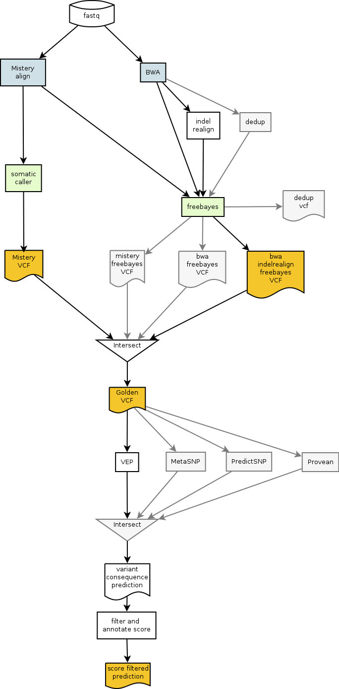

# MCAC

## Myocardiopathies and Arhythmogenic Channelopathies

"Mistery" files were created by misterious software installed on the
MiSeq control computer.

Will align reads against hg19, with BWA.

Got bundle of dbsnp etc. from GATK.

