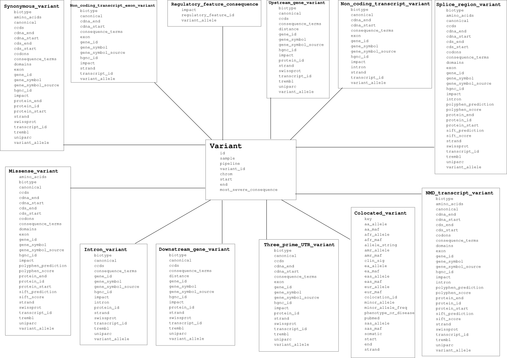

#Extract->Transform->Load pipeline

These scripts transform the output from Variant Effect Predictor and
load it to a MongoDB.

Filtering mongo we create relational databases.

This is the schema of Variant Effect Predictor's tables:

